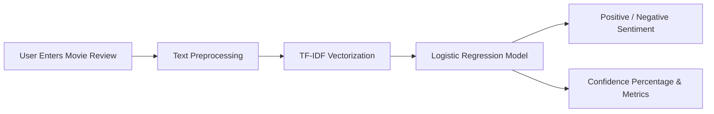

# 🎬 IMDB Movie Review Sentiment Analysis

An end-to-end, reproducible Machine Learning project for binary sentiment classification of movie reviews from the IMDB dataset. The project compares classical NLP vectorization techniques (**Bag-of-Words** and **TF-IDF**) alongside linear machine learning algorithms (**Logistic Regression** and **Linear SVM / LinearSVC**), explores loss dynamics, feature interpretability, decision thresholds, and model ablations, and deploys the best-performing model as an interactive **Streamlit** web application.

---

## 🚀 Live Demo

Experience the live application on Streamlit Community Cloud:

👉 **[Launch Streamlit Live Demo](https://ahmedshaban0-imdb-sentiment-analysis-app-enwzni.streamlit.app/)**

---

## 📓 Notebook

The complete research, data cleaning, modeling, and evaluation workflow is documented in:
- [`notebooks/IMDB_Project.ipynb`](notebooks/IMDB_Project.ipynb)

The notebook executes sequentially from top to bottom on a clean kernel without external state dependencies.

---

## 🎯 Objectives

- Perform binary sentiment classification on IMDB movie reviews (Positive vs. Negative).
- Construct a robust, leakage-free text preprocessing pipeline.
- Benchmark **Bag-of-Words** (`CountVectorizer`) vs. **TF-IDF** (`TfidfVectorizer`).
- Evaluate **Logistic Regression** and **Linear Support Vector Machines** (`LinearSVC`).
- Analyze Stochastic Gradient Descent (SGD) log loss trajectories across training epochs.
- Conduct decision threshold sensitivity analysis ($0.3$, $0.5$, $0.7$).
- Extract and visualize high-impact sentiment tokens (Feature Importance).
- Execute a targeted ablation experiment on the influential token `"worst"`.
- Conduct qualitative error analysis on False Positives and False Negatives.
- Mathematically derive logits, sigmoid activations, and Binary Cross-Entropy loss.
- Deploy the optimal trained model via an interactive Streamlit application.

---

## 📊 Dataset

- **Dataset**: Large Movie Review Dataset (IMDB)
- **Total Samples**: 50,000 reviews
- **Class Distribution**: Exactly balanced — 25,000 Positive reviews, 25,000 Negative reviews
- **Format**: Tabular CSV (`review`, `sentiment`)
- **Data Acquisition**: Automatically downloaded from Google Drive using `gdown` directly in the notebook. Raw data is excluded from Git tracking via `.gitignore`.

---

## 🧹 Text Preprocessing

The preprocessing pipeline standardizes unstructured text inputs while retaining critical sentiment signals:

1. **HTML Tag Removal**: Strips markup such as `<br />` using `BeautifulSoup`.
2. **Movie Rating Preservation**: Normalizes patterns such as `10/10` or `3/10` into explicit lexical tokens like `rating10 outof10`.
3. **Sentiment Punctuation Marking**: Replaces expressive punctuation (`!` $\to$ `exclamation`, `?` $\to$ `question`) to retain emphatic sentiment cues.
4. **Negation Affixation**: Couples negation tokens to following words (e.g., `not good` $\to$ `not_good`) to capture reversed polarity in n-gram representations.
5. **Contraction Expansion**: Resolves common English contractions (e.g., `didn't` $\to$ `did not`) via `contractions`.
6. **Lowercasing**: Uniform case folding across all characters.
7. **Special Character Cleaning**: Eliminates non-alphanumeric symbols while retaining intra-word spacing.
8. **Whitespace Normalization**: Collapses multi-space sequences and strips boundaries.

---

## 🔤 Feature Engineering

### Bag-of-Words (`CountVectorizer`)
- Maps documents to sparse vectors of token frequencies.
- Configuration: `max_features=40000`, `ngram_range=(1, 2)`, `min_df=2`, `max_df=0.98`.
- **Limitation**: Ignores word ordering, syntax, and long-range semantic context.

### TF-IDF (`TfidfVectorizer`)
- Balances Term Frequency against Inverse Document Frequency:
  $$\text{TF-IDF}(t, d) = \text{TF}(t, d) \times \log\left(\frac{1 + N}{1 + \text{DF}(t)}\right) + 1$$
- Configuration: `sublinear_tf=True`, `max_features=40000`, `ngram_range=(1, 2)`, `min_df=2`, `max_df=0.98`.
- Sublinear scaling dampens the disproportionate weight of repeated words, while IDF discounts ubiquitous non-discriminative terms.

### Preventing Data Leakage
The 80/20 train/test split (40,000 train / 10,000 test) is performed **strictly before** vectorizer fitting. The vocabulary is learned exclusively from the training split, and the test split is transformed using the fixed vocabulary.

---

## 🤖 Machine Learning Models

### Logistic Regression
- Models the log-odds of a review being positive via a linear combination of feature weights.
- Regularized using L2 penalty ($C$ parameter tuning over $\{0.1, 0.5, 1, 2, 5, 10\}$).
- Employs the `liblinear` coordinate descent solver.
- Yields calibrated posterior probabilities $\sigma(z) = \frac{1}{1 + e^{-z}}$.

### Linear Support Vector Machine (`LinearSVC`)
- Maximizes the margin separating positive and negative reviews in the 40,000-dimensional sparse feature space.
- Highly effective for sparse, high-dimensional text data where linear separability is strong.

---

## 🧪 Experiments

1. **Regularization Search ($C$-parameter)**:
   - BoW Logistic Regression achieves peak test accuracy at $C = 0.1$ ($0.9122$).
   - TF-IDF Logistic Regression achieves peak test accuracy at $C = 5.0$ ($0.9199$).
2. **SGD Convergence Analysis**:
   - Monitored training Binary Cross-Entropy loss across 20 epochs using `SGDClassifier`.
   - Both representations exhibit smooth monotonic loss convergence.
3. **Threshold Sensitivity Analysis**:
   - Evaluated decision boundaries at $\tau \in \{0.3, 0.5, 0.7\}$.
   - $\tau = 0.3$: Prioritizes Recall ($96.96\%$ on TF-IDF) by lowering positive detection bar.
   - $\tau = 0.7$: Prioritizes Precision ($95.49\%$ on TF-IDF) requiring high model confidence.
   - $\tau = 0.5$: Balanced boundary ($91.57\%$ Precision, $92.50\%$ Recall).
4. **Feature Importance**:
   - Top positive tokens: `great`, `excellent`, `best`, `wonderful`, `perfect`, `love`.
   - Top negative tokens: `worst`, `bad`, `awful`, `waste`, `boring`, `terrible`, `poor`.
5. **Ablation Study**:
   - Setting the weight of the highest-magnitude negative feature (`"worst"`, $w \approx -12.24$) to $0.0$ flipped 11 test predictions and reduced test accuracy from $0.9199$ to $0.9198$.
6. **Error Analysis**:
   - False Positives stem from sarcastic reviews with enthusiastic phrasing.
   - False Negatives stem from reviews discussing dark/violent movie themes using negative descriptors in a praiseworthy context.
7. **Mathematical Derivation**:
   - Manual step-by-step verification showing logit $z=0.0 \implies \hat{y}=0.5 \implies \text{BCE}=0.693$.
   - Theoretical proof explaining why BCE avoids the vanishing gradients inherent to MSE under sigmoid activations.

---

## 📈 Results

Evaluated on the identical 10,000-sample holdout test partition:

| Model | Feature Representation | Accuracy | Precision | Recall | F1-Score | Binary Cross-Entropy |
|:---|:---|:---:|:---:|:---:|:---:|:---:|
| **Logistic Regression** | **TF-IDF** | **0.9199** | **0.9157** | **0.9250** | **0.9203** | **0.2133** |
| Linear SVM (`LinearSVC`) | TF-IDF | 0.9172 | 0.9126 | 0.9228 | 0.9177 | — |
| Logistic Regression | Bag-of-Words | 0.9122 | 0.9076 | 0.9178 | 0.9127 | 0.2379 |
| Linear SVM (`LinearSVC`) | Bag-of-Words | 0.8915 | 0.8914 | 0.8916 | 0.8915 | — |

---

## 🏆 Best Model

- **Model**: **Logistic Regression** ($C = 5.0$, `solver="liblinear"`, `random_state=42`)
- **Features**: **TF-IDF Vectorizer** (`sublinear_tf=True`, `max_features=40000`, `ngram_range=(1, 2)`)
- **Top Metric**: **91.99% Accuracy**, **92.03% F1-Score**, **0.2133 BCE Loss**
- **Selection Rationale**:
  1. Delivered the highest empirical Accuracy, F1-Score, and Recall across all tested models.
  2. TF-IDF consistently boosted accuracy over Bag-of-Words (+0.77% in Logistic Regression, +2.57% in Linear SVM).
  3. Logistic Regression outputs well-calibrated posterior probabilities via the sigmoid link, enabling real-time confidence scores and threshold tuning in the web application.

---

## 🌐 Streamlit Application

The interactive web application (`app.py`) serves predictions using the serialized artifacts:



### Key Application Features:
- **Instant Inference**: Loads pre-trained model and vectorizer at startup; no retraining during runtime.
- **Example Reviews**: One-click positive, negative, and nuanced sample reviews for quick demonstration.
- **Confidence Visualization**: Calibrated probability breakdown (Positive % vs. Negative %) with confidence progress bars.
- **Preprocessing Inspector**: Transparent collapsible panel displaying original text, cleaned text, non-zero feature counts, and raw decision scores.
- **Robust Error Handling**: Clean user-facing messages for empty inputs and missing artifacts without exposing stack traces.

---

## 🏗️ Project Structure

```
IMDB-Sentiment-Analysis/
│
├── app.py                      # Streamlit interactive web application
│
├── notebooks/
│   └── IMDB_Project.ipynb      # Cleaned, reproducible, end-to-end ML notebook
│
├── model/
│   ├── sentiment_model.joblib  # Trained TF-IDF Logistic Regression model (320 KB)
│   └── vectorizer.joblib       # Fitted TF-IDF Vectorizer (1.55 MB)
│
├── requirements.txt            # Minimal required production dependencies
├── .gitignore                  # Git exclusions for datasets, venv, and checkpoints
├── LICENSE                     # MIT License
└── README.md                   # Project documentation and empirical reports
```

---

## ⚙️ Installation

### 1. Clone the Repository
```bash
git clone <repository-url>
cd IMDB-Sentiment-Analysis
```

### 2. Create and Activate a Virtual Environment
```bash
# On Linux/macOS
python -m venv .venv
source .venv/bin/activate

# On Windows
python -m venv .venv
.venv\Scripts\activate
```

### 3. Install Dependencies
```bash
pip install -r requirements.txt
```

---

## 💻 Usage

### Run the Streamlit Application
```bash
streamlit run app.py
```
Open your browser at `http://localhost:8501`.

### Run the Jupyter Notebook
```bash
jupyter notebook notebooks/IMDB_Project.ipynb
```

---

## 🛠️ Technologies

- **Language**: Python 3.11
- **Machine Learning**: Scikit-Learn (Logistic Regression, LinearSVC, SGDClassifier, CountVectorizer, TfidfVectorizer)
- **Natural Language Processing**: BeautifulSoup4, Contractions, Regular Expressions
- **Data Manipulation**: Pandas, NumPy
- **Visualization**: Matplotlib, Seaborn
- **Model Serialization**: Joblib
- **Web Framework**: Streamlit
- **Environment**: Jupyter Notebook

---

## ⚠️ Limitations

- **Bag-of-Words / N-gram Semantics**: While bigrams capture immediate adjacent words (e.g., `not_good`), bag-of-words architectures lack deep understanding of complex sentence structures or long-range dependencies.
- **Sarcasm and Irony**: Subtle sarcasm containing predominantly praise-oriented vocabulary can mislead linear classifiers.
- **Domain Specificity**: The model is optimized for movie reviews; vocabulary and sentiment distributions in other domains (e.g., financial news, customer support) may experience performance shifts.
- **Contextual Representations**: The model does not utilize contextual token embeddings (e.g., BERT, RoBERTa).

---

## 🔮 Future Improvements

- Pre-trained transformer fine-tuning (e.g., DistilBERT, RoBERTa) for deep contextual semantic understanding.
- Static embedding comparison (Word2Vec, GloVe, FastText).
- Sequential recurrent models (BiLSTM, GRU with attention mechanisms).
- K-fold cross-validation across multiple random seeds.
- Automated hyperparameter search with Bayesian optimization.
- Production containerization and continuous integration (CI) test workflows.

---

## 📄 License

This project is licensed under the MIT License — see the [LICENSE](LICENSE) file for details.
